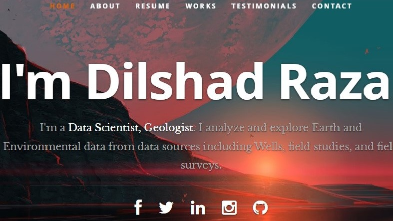

# React JS Portfolio Website   

Live App at: https://dilshadgeo.netlify.app/

# How to run

- Clone the Repository from github
- Open in VSCode
- Open New Terminal
- run command in the terminal **npm install**
- it will install all the dependencies.
- then in terminal run command **npm start**
## Description
This is a ReactJS based personal resume website. I have built this by following a Udemy course (credits below) and by beginning with the Ceevee template by Styleshout (credits also below), and breaking up their template into isolated React components. Data is fed directly from a JSON File. This means that in its final form, it can be customized and used by anybody simply by filling in their own personal info into the JSON file and the changes will be dynamically fed into the site. Its available and can be used to build your own resume/portfolio website.

## Credits
##### Udemy Course
<a href="https://www.udemy.com/projects-in-reactjs-the-complete-react-learning-course/learn/v4/overview">Projects in ReactJS: The Complete React Learning Course by Eduonix</a>

#### HTML Design Template
<a href="https://www.styleshout.com/free-templates/ceevee/">Ceevee Template by Styleshout</a>

It was then modified by me according to my personal use.

##### Header photo credit
<a href="https://images.wallpapersden.com/image/download/another-planet-sunset_bGduaGmUmZqaraWkpJRmbmdlrWZlbWU.jpg">Header</a>

##### Testimonial photo credit
<a href="https://wallpaperaccess.com/full/97670.jpg">Testimonial</a>

## **Author**
Dilshad Raza,\
Institute of Geology,\
University of the Punjab\
Lahore, 54590, Pakistan.
